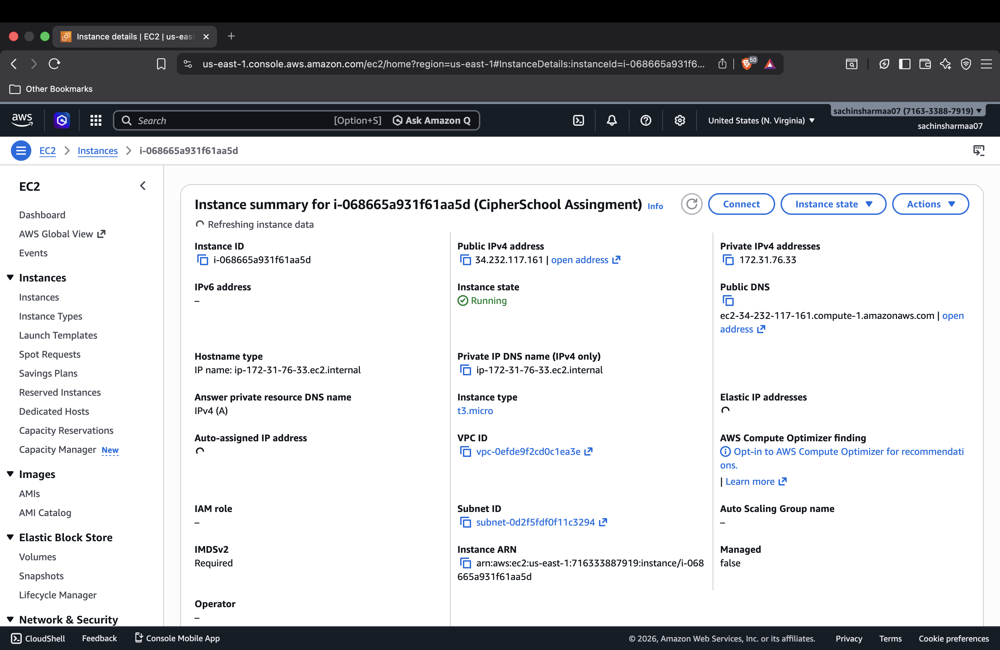
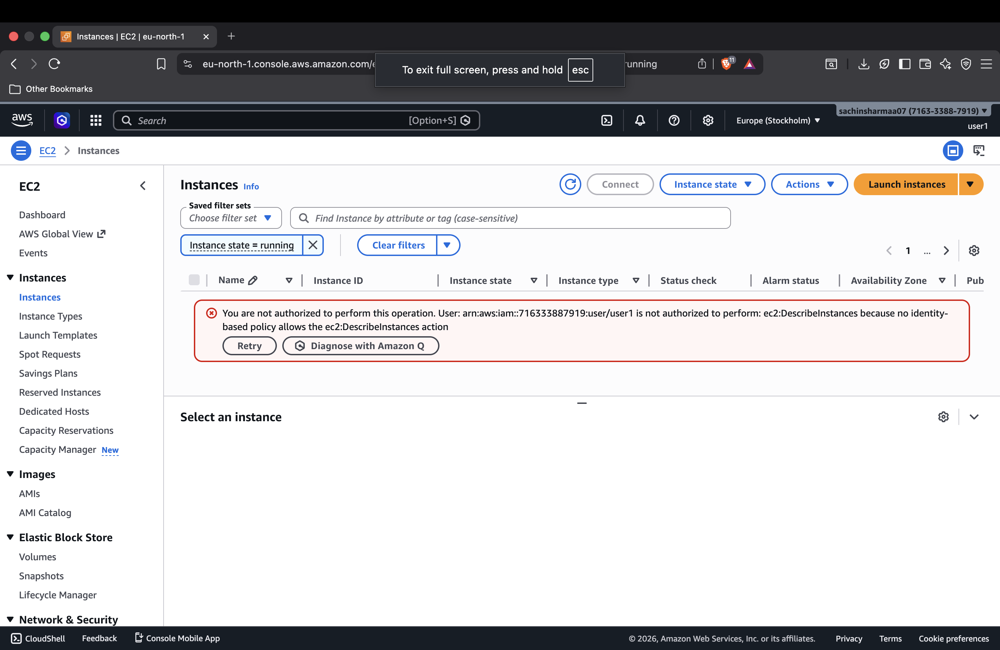
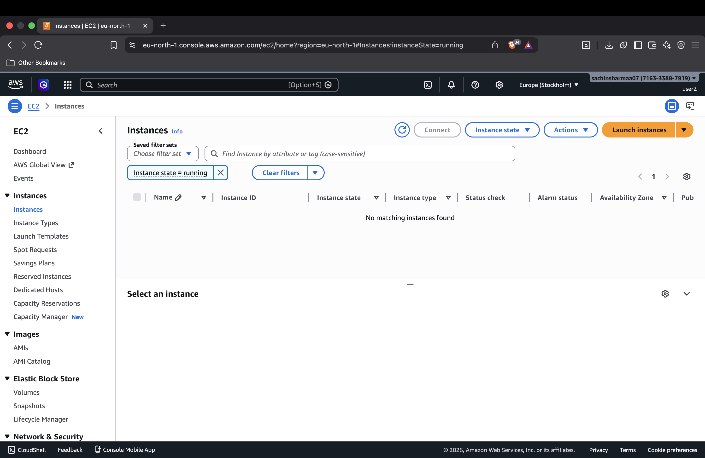

# Assignment 01: AWS EC2 Static Website Hosting with IAM Access Control

## Student Details
- Name: Sachin Sharma
- Course Platform: Cipher Schools
- Assignment: AWS EC2 Static Website Hosting with IAM Access Control

## Live Deployed Project Link
- Elastic IP: http://34.232.117.161/

---

## Assignment Question (Given)

### Submission Requirements
- GitHub repository is complete and public
- Deployed link is working (via Elastic IP)
- EC2 instance and Elastic IP remain active till 19/04/2026, 11:59 PM
- Submit before: 19/04/2026, 06:00 PM (strict)

### Assignment Description
1. Launch an EC2 instance and host a static website (HTML, CSS, JS) using a web server such as Apache2 / Nginx / httpd
2. Create two IAM users:
	- User 1: No permissions (should not be able to view EC2 instances)
	- User 2: Should have permissions to view and interact with EC2 instances

### Readme Must Include
- Deployed project link (using Elastic IP)
- EC2 instance screenshot (AWS Console): username visible
- Screenshot of login from User 1
- Screenshot of login from User 2
- Challenges or issues faced

## Project Overview
This project demonstrates hosting a static website on an AWS EC2 Ubuntu instance using the Nginx web server. The website is deployed using an Elastic IP for public access. The assignment also includes IAM user access control with two users having different permission levels.

## Technologies Used
- Amazon Web Services (AWS)
- EC2 Instance
- Elastic IP
- IAM (Identity and Access Management)
- Ubuntu Server
- Nginx
- HTML5
- CSS3
- JavaScript
- GitHub

## AWS EC2 Setup Process

### Step 1: Launch EC2 Instance
- Launched Ubuntu EC2 instance from AWS Console.
- Selected an appropriate security group.

### Step 2: Security Group Configuration
Allowed inbound traffic for:
- SSH (Port 22)
- HTTP (Port 80)
- HTTPS (Port 443)

### Step 3: Connect to Server
Connected securely using the .pem key file through SSH.

### Step 4: Install Nginx
```bash
sudo apt update
sudo apt install nginx -y
sudo systemctl start nginx
sudo systemctl enable nginx
```

### Step 5: Deploy Website Files
Uploaded project files:
- index.html
- styles.css
- script.js
- images/assets

Copied files into:
```bash
/var/www/html
```

Restarted server:
```bash
sudo systemctl restart nginx
```

## IAM Access Control Setup

### User 1: Restricted User
Created IAM user:
```bash
user1
```

Permissions:
- No policies attached

Result:
- User can login
- Cannot access EC2 resources

### User 2: Authorized User
Created IAM user:
```bash
user2
```

Permissions:
Attached policy:
```bash
AmazonEC2FullAccess
```

Result:
- User can login
- Can access and manage EC2 resources

## Screenshots

### 1) EC2 Instance Running


### 2) Live Website Screenshot


### 3) IAM User1 Login (Access Denied)


### 4) IAM User2 Login (EC2 Access)


## Project Folder Structure
```bash
EC2_/
│── index.html
│── styles.css
│── script.js
│── README.md
│── imgs/
│   ├── ec2-instance.png
│   ├── user1-access-denied.png
│   ├── user2-ec2-access.png
│   └── live-website.png
```

## Features of Website
- Responsive static website
- Hosted on AWS EC2
- Publicly accessible via Elastic IP
- Fast delivery through Nginx
- Secure IAM role-based access control

## Challenges Faced

### SSH Key Access
Initially needed correct .pem file permissions.

Solution:
```bash
chmod 400 mykey.pem
```

### Nginx Deployment
Old website files had to be removed before uploading new project.

### IAM Password Reset
IAM users required first-time password reset on login.

### Security Group Rules
Ensured port 80 was open for website access.

## Learning Outcomes
Through this assignment I learned:
- Launching and configuring AWS EC2
- Hosting websites on Linux server
- Using Nginx web server
- Working with Elastic IP
- IAM user creation and permissions
- Secure remote server management using SSH
- Real-world cloud deployment workflow

## GitHub Repository
Add your GitHub repository link here:
```
https://github.com/yourusername/aws-ec2-static-hosting
```

## Assignment Status
- EC2 Instance Running
- Website Hosted Successfully
- Elastic IP Configured
- IAM Users Created
- GitHub Repository Public
- Screenshots Added

## Thank You
